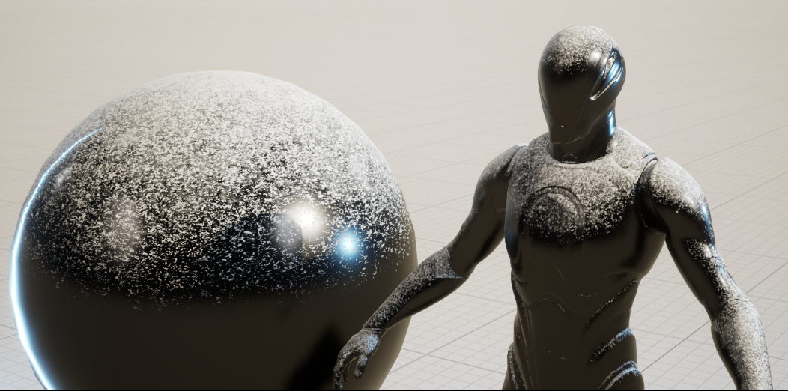
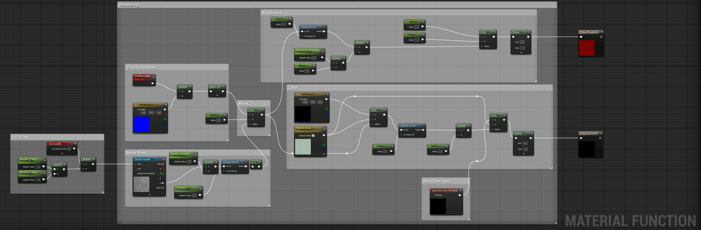
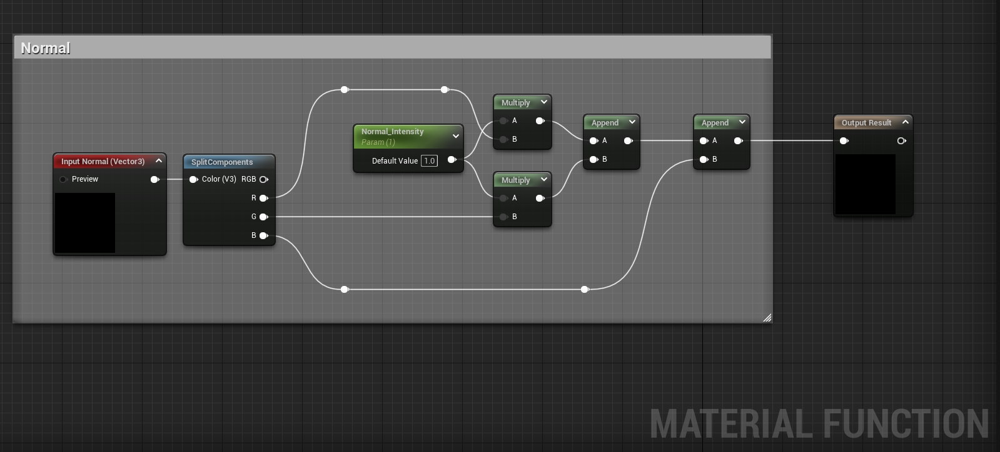
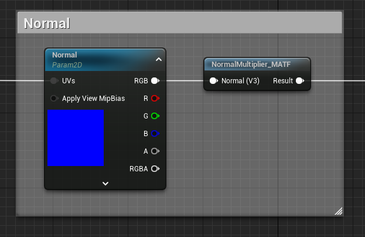
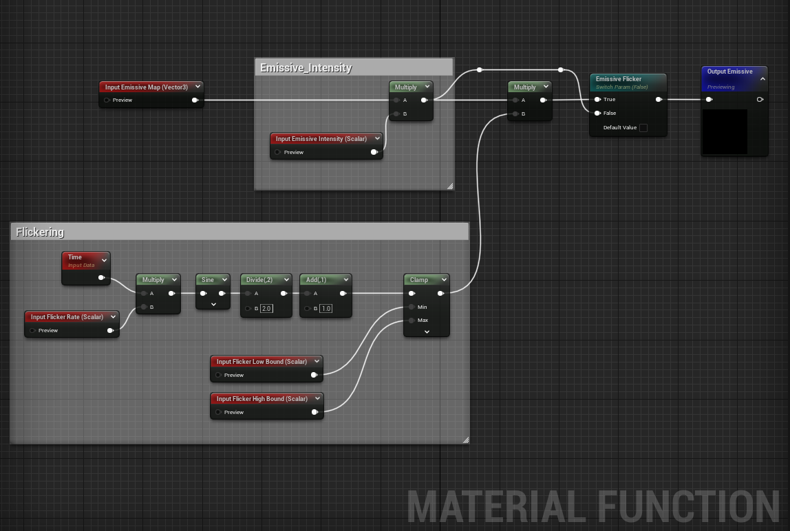

# Mohammed Qamar | Unreal Material Functions Showcase 🎮🎨

## About This Repository

This repository showcases a collection of custom material functions I've created using Unreal Engine. These functions simplify complex shader operations and can be easily integrated into other projects.

---

## Material Functions Gallery 🖼️

### Function 1: Weathering

**Description:**  
The Weathering material function simulates natural wear and tear effects on surfaces. It can be easily adjusted for varying degrees of erosion, fading, and detail decay. Perfect for creating more lifelike environments, props, or even characters.

---

### Function 2: NormalMultiplier

**Description:**  
NormalMultiplier enhances the impact of normal maps on your materials. This function allows you to amplify or dampen the normal intensity, providing extra control over how light interacts with your surfaces. Ideal for adding extra depth or subtlety to your textures.

---

### Function 3: EmissiveFlicker

**Description:**  
EmissiveFlicker adds dynamic lighting variations to your emissive materials. This function generates a flickering effect that can be adjusted for speed, intensity, and randomness. It's excellent for simulating unstable lights, glowing objects, or animated screen displays.

---

## How To Use 👨‍💻

To use any of these material functions in your own project, simply download the `.uasset` files located in the `MaterialFunctions` folder and place them into the `Content` directory of your Unreal Engine project.

---

## Contact 📫

Feel free to connect with me:

- GitHub: [@moqam](https://github.com/moqam)
- Email: qamar@moqam.ca
- Portfolio: [moqam.ca](https://moqam.ca)

---

## License 📝

This project is licensed under the MIT License. See the [LICENSE](LICENSE.md) file for details.
