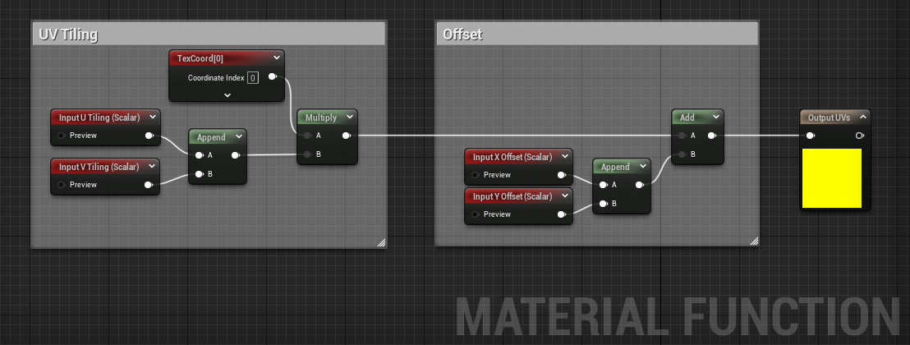
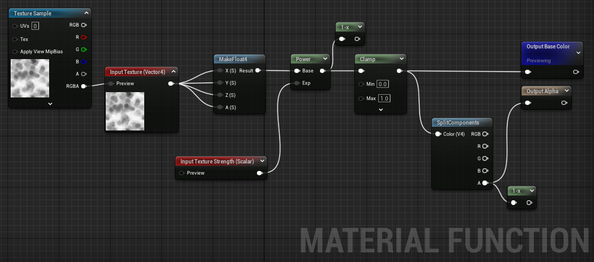

# Unreal Material Functions Showcase 🎮🎨

## About This Repository

This repository showcases a collection of custom material functions I've created using Unreal Engine. These functions simplify complex shader operations and can be easily integrated into other projects.

---

## Material Functions Gallery 🖼️

### Function 1: Weathering

**Description:**  
The Weathering material function simulates natural wear and tear effects on surfaces. It can be easily adjusted for varying degrees of erosion, fading, and detail decay. Perfect for creating more lifelike environments, props, or even characters.

---

### Function 2: NormalMultiplier

**Description:**  
NormalMultiplier enhances the impact of normal maps on your materials. This function allows you to amplify or dampen the normal intensity, providing extra control over how light interacts with your surfaces. Ideal for adding extra depth or subtlety to your textures.

---

### Function 3: EmissiveFlicker

**Description:**  
EmissiveFlicker adds dynamic lighting variations to your emissive materials. This function generates a flickering effect that can be adjusted for speed, intensity, and randomness. It's excellent for simulating unstable lights, glowing objects, or animated screen displays.

---

### Function 4: Tiling & Offset

**Description:**  
The Tiling & Offset function allows for precise control over the repetition and positioning of textures within your material.The offset parameters enable you to shift the texture coordinates, providing an additional layer of customization. This function brings together both tiling and offset controls into a single, user-friendly interface, enhancing workflow efficiency and creative flexibility.

---

### Function 5: Texture Strength

**Description:**  

---
### Function 6: Emissive Pulse

**Description:**  
Emissive Pulse creates a rhythmic glowing effect for emissive materials. This function pulses the emissive strength in a predictable manner, making it great for simulating heartbeat-like glows, rhythmic light sources, or any other patterned light emission. The pulse frequency, intensity, and falloff can be easily adjusted to fit different artistic needs.

---
### Function 7: Pulse

**Description:**  
The Pulse function generates a circular pulsating effect originating from a specified vector2 coordinate, utilizing the object's UVs. 
This ripple-like effect is perfect for simulating effects like a drop hitting water, a radar ping, or any scenario where a wave emanates from a central point. The function offers controls over the pulse's intensity, frequency, and falloff, ensuring adaptability to various artistic and technical needs.

---

## How To Use 👨‍💻

To use any of these material functions in your own project, simply download the `.uasset` files located in the `MaterialFunctions` folder and place them into the `Content` directory of your Unreal Engine project.

---

## Contact 📫

Feel free to connect with me:

- GitHub: [@moqam](https://github.com/moqam)
- Email: qamar@moqam.ca
- Portfolio: [moqam.ca](https://moqam.ca)

---

## License 📝

This project is licensed under the MIT License. See the [LICENSE](LICENSE.md) file for details.
